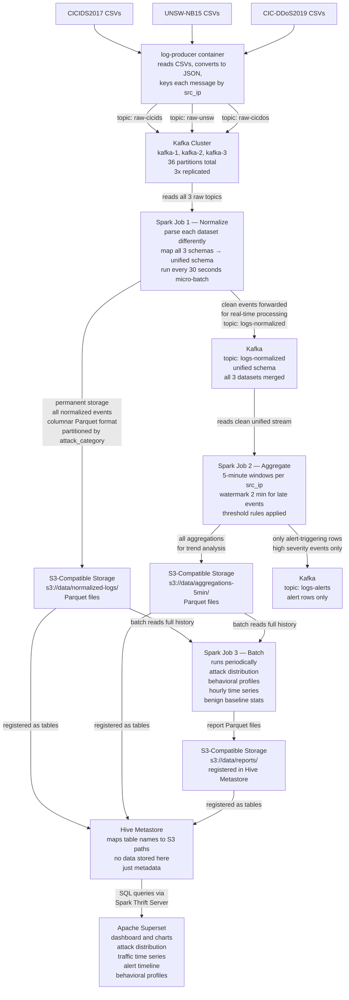

# Initial Plan: Data Processing Pipeline

This document outlines the architecture for our log processing and analytics pipeline. The data storage layer uses S3-compatible storage.

## Architecture Diagram

## Storage Layer
All data is stored in S3-compatible object storage. This includes:
- **Normalized logs:** `s3://data/normalized-logs/` (partitioned by attack category)
- **Aggregations:** `s3://data/aggregations-5min/` (5-minute windows)
- **Reports:** `s3://data/reports/` (batch job outputs)

Hive Metastore is used to map table names to their corresponding S3 paths to allow for SQL querying via Spark Thrift Server.
